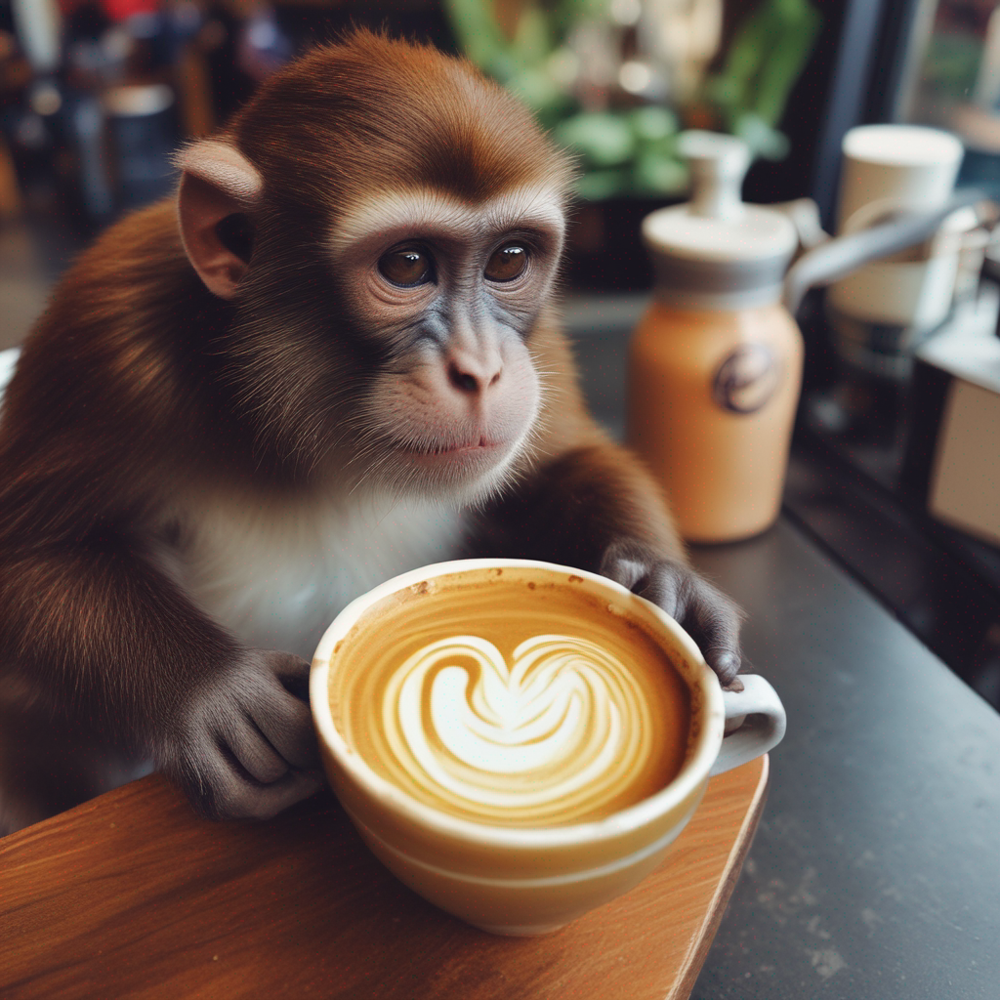

# sdxl-multi-controlnet-lora Cog model

This is an implementation of the [sdxl-lightning](https://huggingface.co/ByteDance/SDXL-Lightning) with Controlnet LoRAs as a Cog model. [Cog packages machine learning models as standard containers.](https://github.com/replicate/cog)

Run predictions:

    cog predict -i prompt="A monkey making latte art" -i seed=2992471961

## Examples:

txt2img: A monkey making latte art

